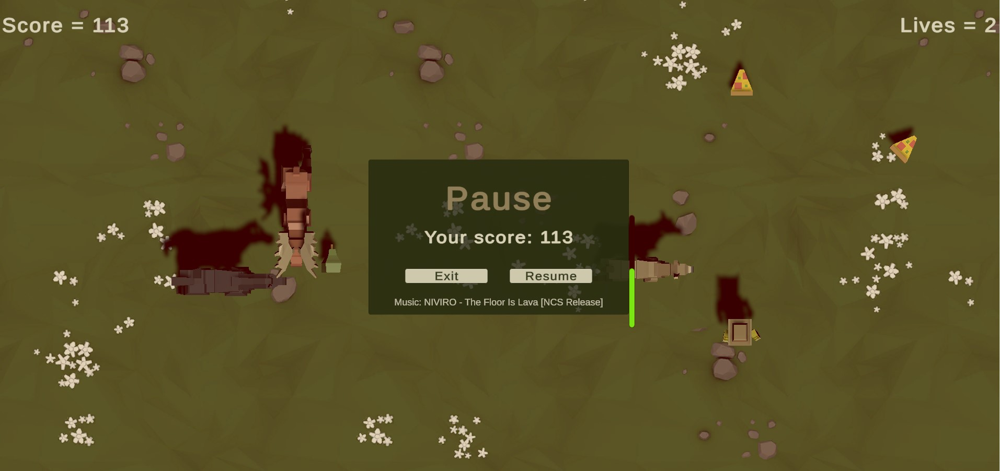

# Prototype 2 (Unity 6)



**Prototype 2** is an interactive Unity game prototype developed as part of the **Unity Junior Programmer Pathway (Unity 6)**.  
It features enhanced gameplay mechanics including player movement, power-ups, scoring, UI interaction, and simple game logic.


---

## ▶️ Play Demo

- [🎮 Unity Play Demo](https://play.unity.com/en/games/3c1cdda2-36fa-403b-bb84-823e5bc5081c/prototype2unity6)
- [🌐 itch.io Demo](https://faez-mahmoudi.itch.io/prototype2-webgl-v5)


## ▶️ Gameplay Video

- [Watch Gameplay Video](Videos/Prototype2_Unity6.mp4)

---


## 🧠 About

This project demonstrates core Unity skills such as:

- Player movement and controls
- Power-up system and timers
- Collision detection
- UI elements (score, lives, notifications)
- Simple game logic and state management

The goal of this prototype is to practice basic interactive game mechanics using Unity and C#.

---

## 🚀 Features

✔ Smooth player movement  
✔ Power-up pickup and timer system  
✔ Lives and score tracking  
✔ UI panels for power-ups and lives    
✔ UI slider for animal hunger bar  
✔ Playable WebGL build  

---

## 🎮 How to Play

- **W / A / S / D** or **Arrow Keys** → Move player  
- **Collect power-ups** to gain temporary abilities  
- **Collect lives** to increase remaining tries
- **Space Key** → Feed with pizza  
- Avoid hazards and survive  

---

## 📦 Getting Started

### 🔹 Clone the repository
```bash
git clone https://github.com/Faez-Mahmoudi/Prototype2_Unity6.git
